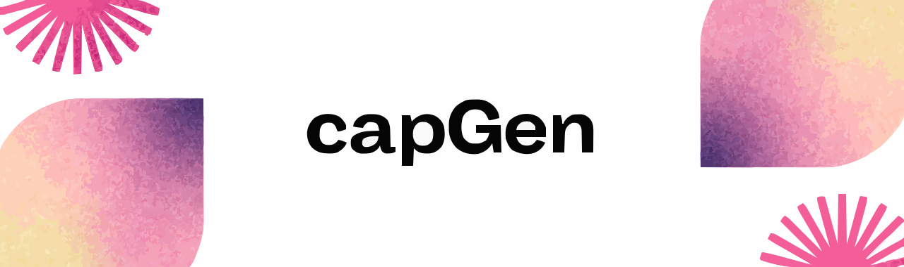

> AI-powered Instagram caption, hashtag & song recommendation generator.

Upload a photo, pick a vibe, and get ready-to-post captions with trending hashtags and song previews — all in one click.


## Features

- 📸 **Image Upload** — Drag & drop or click to upload (JPG, PNG, JPEG)
- 🎨 **12 Vibe Presets** — Aesthetic, Funny, Professional, Poetic, Sassy, Casual, Romantic, Trendy, Motivational, Nostalgic, Minimal, Adventurous
- ✍️ **AI Captions** — Context-aware captions generated from your image
- #️⃣ **Smart Hashtags** — Relevant hashtags with popularity indicators (Low / Medium / High / Trending)
- 🎵 **Song Recommendations** — Curated songs with 30-second previews via Deezer API
- 📱 **Fully Responsive** — Works beautifully on mobile, tablet, and desktop

## Tech Stack

| Layer | Technology |
|-------|------------|
| **Frontend** | HTML, Tailwind CSS, Vanilla JavaScript |
| **Backend** | Django, LangChain |
| **AI / Vision** | Google Gemini 2.5 Flash (multimodal) |
| **Music Previews** | Deezer API |
| **Deployment** | Railway |

## Try CapGen

🚀 **[Try capGen](https://your-railway-url.up.railway.app)** *(replace with your URL)*

## Screenshots

| Upload | Results |
|--------|---------|
|  |  |


## Project Structure

```
capGen/
├── config/                  # Django project configuration
│   ├── asgi.py
│   ├── settings.py
│   ├── urls.py
│   └── wsgi.py
├── core/                    # Main application
│   ├── apps.py
│   ├── urls.py
│   ├── views.py
│   └── services/
│       ├── caption.py       # Caption generation service
│       └── music.py         # Music generation service
├── templates/               # HTML templates
├── static/                  # Static files (CSS, JS, images)
├── images/                 # banners,screen shots of the website for readme
├── config/                 # Configuration files
├── .env                    # Environment variables
├── manage.py               # Django management script
├── requirements.txt        # Python dependencies
└── db.sqlite3              # SQLite database
```

## Usage

1. **Upload** a photo you want to post
2. **Select a Vibe** that matches your mood (e.g., *Aesthetic*, *Funny*)
3. **Choose** how many results you want (3, 5, or 10)
4. **Click Generate** and wait a few seconds
5. **Browse results** — copy captions, check hashtag popularity, preview songs
6. **Post to Instagram** 🎉


## Contributing

Contributions are welcome! Please open an issue or submit a pull request.

1. Fork the repository
2. Create your feature branch (`git checkout -b feature/amazing-feature`)
3. Commit your changes (`git commit -m 'Add amazing feature'`)
4. Push to the branch (`git push origin feature/amazing-feature`)
5. Open a Pull Request

## License

Distributed under the MIT License. See `LICENSE` for more information.

---

Built with 💛 for Instagram creators everywhere.

> **Disclaimer:** capGen is an independent tool and is not affiliated with, endorsed by, or connected to Instagram or Meta Platforms, Inc.
